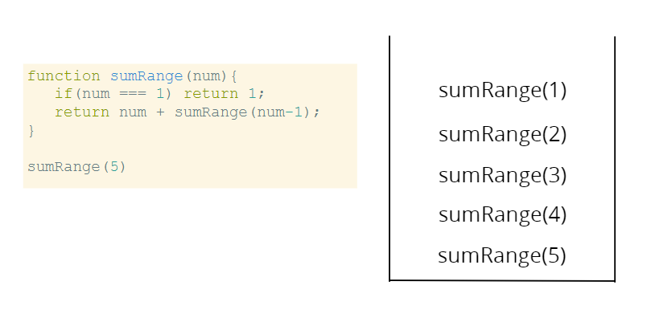

# Recursion

## Recursion

### Recursion

#### Recursion

# ITERATION & RECURSION

## OBJECTIVES

-   Define what recursion is and how it can be used
-   Understand the two essential components of a recursive function
-   Visualize the call stack to better debug and understand recursive functions
    Use helper method recursion and pure recursion to solve more difficult problems.

### What is recursion?

A **process** (a function in our case) that **calls itself**

## Why do I need to know this?

1. It's everywhere
    - JSON.parse/JSON.stringify
    - document.getElementsById and DOM traversal algorithms
    - object traversal
    - It's sometimes a cleaner alternative to iteration
2. It becomes very important in more advanced algorithms

## But first... Let's talk about functions

-   In almost all program languages, there is a built in data structure that manages what happens when functions are invoked.

### The Call Stack

-   It's a **stack** data structure - we'll talk about that later!
-   Any time a function is invoked it is placed **(pushed)** on the top of the call stack.
-   When JavaScript sees the **return** keyword or when the function ends, the compiler will remove **(pop)**

### Why do I care?

-   You're used to functions being pushed on the call stack and popped off when they are done.
-   When we write recursive functions, we keep pushing new functions onto the call stack!

## First Recursive Function

### How recursive functions work

Invoke the **same** function with a different input until you reach your base case!

### Base Case

The condition when the recursion ends.

**This is the most important concept to understand**

### Two essential parts of a recursive function!

-   Base Case
-   Different Input

### Our first recursive function

```js
function countDown(num) {
    if (num <= 0) {
        console.log("All done!");
        return;
    }
    console.log(num);
    num--;
    countDown(num);
}
```

## Our second recursive function

```js
function sumRange(num) {
    if (num === 1) return 1;
    return num + sumRange(num - 1);
}
```

Can you spot the base case?

Do you notice the different input?

What would happen if we didn't return?

### The ALL important `return` keyword

```js
function sumRange(num) {
    if (num === 1) return 1;
    return num + sumRange(num - 1);
}
```

Let's break this down step by step!

### sumRange with the call stack



## Another example

```js
function factorial(num) {
    if (num === 1) return 1;
    return num * factorial(num - 1);
}
```

Let's visualize the call stack!
